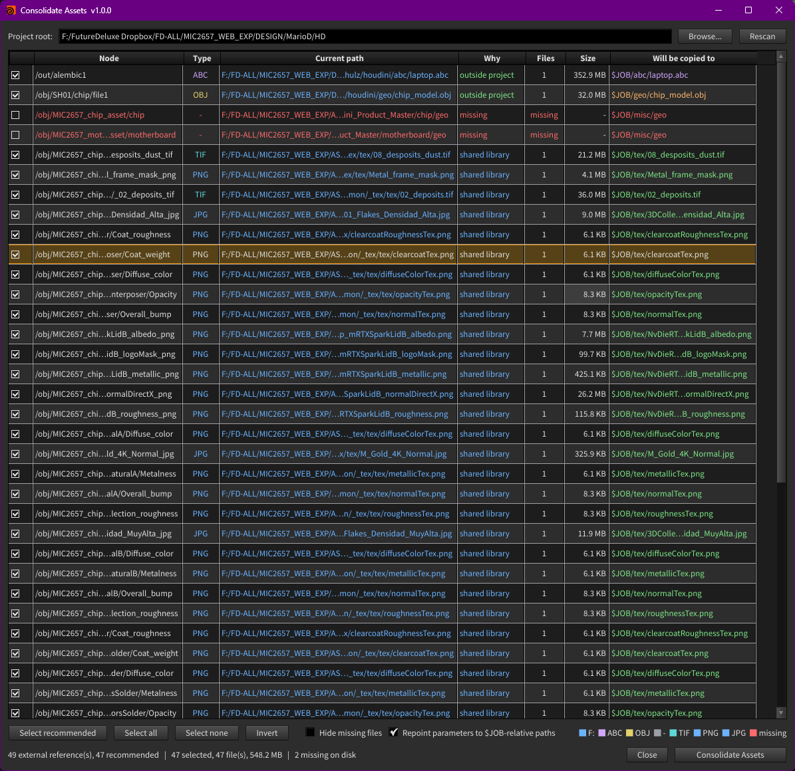
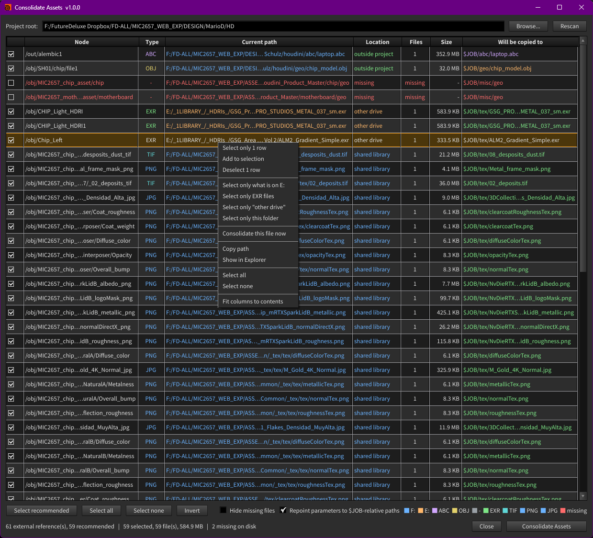

# Houdini Asset Consolidator

A Houdini tool that finds every file your scene references from outside the
project and copies those files in, repointing the parameters as it goes.

Useful before archiving a shot, handing a scene to someone else, or sending it
to a farm -- the cases where a texture sitting on your own D: drive quietly
turns into a missing file for everyone else.

Houdini 20.5+ | Windows, macOS, Linux | GPL-3.0

Menu: **Tools > Consolidate Assets**

Every external reference in the scene, what kind of place it lives in, and
where it will land. Click a column heading to sort. Right-click isolates a
group -- one drive, one file type, one folder, or one kind of location:

## What it does

1. Walks every file-typed parameter in the scene.
2. Flags the ones resolving outside the project root.
3. Shows them in a table: node, type, current path, location, size and
   destination.
4. You tick and untick whatever you want.
5. "Consolidate Assets" copies them in and repoints the parameters.

Nothing is copied until you press the button, and nothing is ever overwritten.

## Project root

`$HIP` -- the folder holding the open `.hip` file. Shown at the top of the
window and overridable with Browse.

`$HIP` is the default because it is always defined and always correct for the
open scene. `$JOB` has to be set per session, and when it is not it silently
falls back to the user home folder, so a "portable" path resolves only on the
machine that wrote it.

## Choosing the variable

The **Use variable** field decides which token gets written into consolidated
paths. `$HIP` and `$JOB` are offered, and the field is editable, so a studio
variable (`$SHOT`, `$SHOW`, anything Houdini defines) can be typed instead.

The field validates as you type:

| Shown | Meaning |
|---|---|
| green `$HIP = F:/proj/shot01` | Resolves to the project root, good to use |
| orange `$JOB is F:/proj -- not the project root, so $HIP is used` | Set, but to a different folder |
| red `$SHOT is not set -- using $HIP` | Not defined in this session |

When a variable points somewhere other than the root, a **Use \<var\> as root**
button appears next to it. Clicking it moves the project root to that folder,
which is usually what you wanted if you picked the variable deliberately.

A variable that does not resolve to the root is never written -- the tool falls
back to whichever known variable does, and to an absolute path if none match.
A token that points somewhere else is worse than an absolute path: it looks
tidy and silently loads the wrong file.

### Update paths in scene

Changes the variable on paths that are **already inside the project**, without
copying anything. Use it when a scene was consolidated with the wrong token, or
to make a mixed scene consistent.

Only paths that **already use a variable** are touched: `$JOB/tex/a.exr`
becomes `$HIP/tex/a.exr`. Hard-coded absolute paths are deliberately left
alone -- turning one into a variable is a different decision from swapping one
variable for another, and doing it silently would rewrite paths you never
asked to touch.

The new value is rebuilt from each path's resolved location rather than by
string-replacing the old token, so any variable converges on the one you pick.
Sequences keep their frame token, files outside the project are left alone,
and running it twice changes nothing the second time.

## Destination routing

| File type | Goes to |
|---|---|
| exr hdr png jpg tif tga dpx rat tx psd | `<root>/tex` |
| bgeo bgeo.sc geo vdb obj fbx usd sim | `<root>/geo` |
| abc | `<root>/abc` |
| anything else | `<root>/misc` |

## Recommendations

Everything the scan lists is outside the project, so everything is a valid
candidate. The `Location` column says what kind of place each file lives in,
ranked by how likely that link is to break. The recommended rows are ticked
for you on scan:

| Location | Meaning |
|---|---|
| `temp folder` | In %TEMP% or Downloads. Could vanish on reboot |
| `network path` | On a UNC share. Breaks when the share is offline |
| `other drive` | A different drive from the project |
| `shared library` | Same drive, but a shared asset or library folder |
| `outside project` | Outside the project, nothing else notable |
| `in project` | Already inside the project. Listed only with **Show files already in project**, never ticked |
| `missing` | Not on disk. Never recommended, never ticked |
| `folder` | A directory, not a file. Present and fine. Never ticked |

"Select recommended" re-applies that choice at any time.

**Show files already in project** lists every file the scene references,
including the ones already in the right place. They are never ticked --
there is nothing to consolidate -- but you can see the whole picture and
re-token them.

### A variable can point outside the project

A `$JOB/tex/x.jpg` path is *relative*, but if `$JOB` resolves above your
project root the file is still **outside** it. Those show as external
references to consolidate, not as paths to re-token -- rewriting the
token would silently move where the reference points. "Update paths in
scene" says how many it skipped for this reason.

## Folder references

Some parameters name a **folder** rather than a file. A File Cache in
*Constructed* mode is the common one: its Base Folder points at a directory
and the filename is built from Base Name and Version.

Such a path is present and perfectly valid, so it is not missing -- but
consolidating it means copying a whole tree, which can be tens of gigabytes.
It is listed as `folder`, shown as type `FOLDER` with the real file count and
total size, routed by what is inside it (a geo cache folder goes to `geo`, not
`misc`), and **never ticked for you**. Copying one is always a deliberate
choice.

## Sending files to a custom folder

Select any rows, right-click, **Send N rows to a folder...** and browse. Those
files go where you chose instead of the type routing; everything else is
unaffected. **Reset to default destination** puts them back.

The destination cell turns purple for a custom folder, and orange when that
folder is outside the project.

A custom folder **inside** the project still gets a variable, so the scene
stays portable: choosing `$HIP/textures/bark` writes
`$HIP/textures/bark/wood.exr`. A folder **outside** it cannot -- no token
resolves there -- so the parameter gets an absolute path and the tool warns you
once, when you pick it. That is a real trade-off, not a bug: sending caches to
a fast local drive is a legitimate thing to want, and it does mean the scene
will not open correctly elsewhere.

## Colour coding

Source paths are tinted **per drive**, assigned in first-seen order so any
drive letter or UNC share gets a stable colour. The `Type` column is coloured
**per extension**, and destinations **per target folder**. Missing files are
red and override everything. A legend sits above the status line.

## Table

- **Click a column heading** to sort by it; click again to reverse. Size
  sorts by actual bytes and the file count numerically, not as text.
- **Drag any column divider** to resize -- every column is interactive.
- **Double-click a divider** fits that column; **double-click the header** fits
  every column. Also on the right-click menu.
- **Drag a header** to reorder columns.
- Columns are budgeted against the window width, so long paths elide in the
  middle rather than pushing later columns off screen.
- **Double-click a row** to jump to that node in the network editor.

## Right-click menu

Menu actions **isolate**: they clear every tick first, then select what you
asked for. "Select only this row" on a fully selected table leaves exactly one
row ticked. "Add to selection" is there when you want the additive version.

- **Consolidate this file now** -- copies just that one file, whatever is
  ticked. With several rows selected you also get "Consolidate these N files".
  Both sit at the top of the menu.
- **Send N rows to a folder...** / Reset to default destination
- Select only these rows / Add to selection / Deselect these rows
- Select only what is on the same **drive**
- Select only files of the same **extension**
- Select only this **folder**
- Select only the same kind of **location**
- **Open with default app** -- opens the file in whatever the OS
  associates with its type (the first frame, for a sequence)
- **Go to this node** -- selects it and frames it in the network editor
  (double-clicking a row does the same)
- Copy path, Show in Explorer, Fit columns

Right-clicking a row outside the current selection acts on that row, the way a
file manager does. Missing files are never ticked by any bulk action, and the
per-file consolidate is greyed out for them.

## Behaviour worth knowing

- **Sequences** (`$F`, `$F4`, `%04d`, `####`, `<UDIM>`) copy every frame on
  disk; the parameter keeps its frame token.
- **Name collisions** with a *different* file get a `_1` suffix. An identical
  file already at the destination is skipped, so re-running is a no-op.
- **Missing files** are listed in red, cannot be selected, and never have their
  parameter rewritten.
- **Expression and keyframed parameters are skipped**, so rewriting cannot
  destroy an expression.
- Locked and read-only parameters are reported rather than silently failing.
- The whole run is a single undo block.

## Install

See [INSTALL.md](INSTALL.md). Short version: put the folder somewhere, point a
Houdini package `.json` at it, restart Houdini.

## Status

Working and in use, but young. The scanning, routing and selection logic is
covered by unit tests; the copy step has been tested on synthetic files rather
than years of production scenes. Try it on a copy of a scene first.

## Notes for other tools

[docs/HOUDINI_NOTES.md](docs/HOUDINI_NOTES.md) collects what was learned
building this: how to walk a scene for file parameters, the raw-vs-resolved
distinction, variable handling, and the Qt table traps. Written for anyone
building a sibling tool that scans a scene for paths.

[INTEGRATION.md](INTEGRATION.md) documents the small API surface other tools
call, and what changes would break them.

## Licence

GPL-3.0. See [LICENSE](LICENSE).
